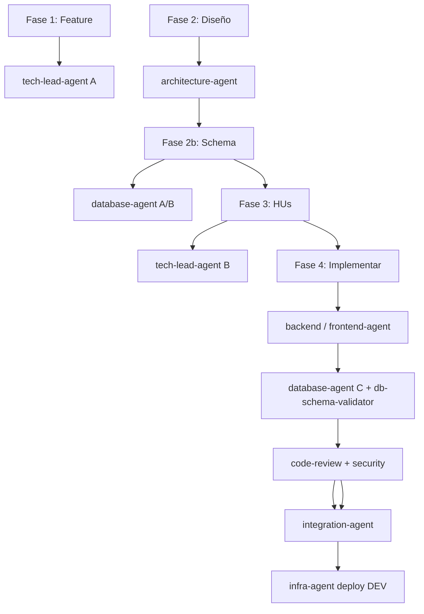

# Workflow: Requirement to Delivery

**Objetivo:** A partir de un requerimiento en texto libre, producir un Feature en ADO con su diseño técnico aprobado, sus Historias de Usuario creadas, implementadas, revisadas, integradas y desplegadas en DEV.

**Invocación típica:**
```
Necesito desarrollar el siguiente requerimiento: [descripción]
```

---

## Precondiciones

- El usuario tiene acceso a Azure DevOps (MCP o REST).
- Existe un sprint activo en el board (el Feature se asigna al **siguiente** sprint, nunca al activo).
- Las credenciales de ADO están en `.env.user-identity`.
- Convenciones de datos vigentes: `docs/database-conventions.md`, `docs/data-access-conventions.md`.

---

## Cadena de agentes (visión general)



---

## Fases — resumen

| # | Fase | Agente | Gate humano |
|---|------|--------|-------------|
| 1 | Crear Feature en ADO | `tech-lead-agent` (modo A) | Aprobación del Feature antes de avanzar |
| 2 | Diseño técnico | `architecture-agent` | Aprobación del diseño antes de descomponer |
| 2b | Schema y migraciones (si hay entidades nuevas) | `database-agent` (modo A/B) | — (automático si diseño aprobado) |
| 3 | Descomponer en HUs | `tech-lead-agent` (modo B) | Aprobación de las HUs antes de crearlas en ADO |
| 4 | Implementar cada HU | `backend-agent` / `frontend-agent` / `database-agent` *(schema)* | Confirmación de activar cada HU en ADO |
| 4b | *(por HU, sub-workflow)* Validación datos | `database-agent` (modo C) + `db-schema-validator` | — *(si hay migraciones)* |
| 4c | *(por HU, sub-workflow)* Review + merge | `code-review-agent` + `security-agent` + `integration-agent` | **Confirmación humana para cada merge** |
| 5 | Deploy a DEV | `infra-agent` | — (automático post-merge) |

---

## Fase 1 — Crear Feature en ADO

**Agente:** `tech-lead-agent` (modo A)

**Instrucción al agente:**
```
Usa el tech-lead-agent (modo A) para redactar un Feature con el siguiente requerimiento: [descripción del usuario]
```

**Outputs esperados:**
- Feature creado en ADO con ID (ej. #9304)
- Campos completos: título, descripción, criterios funcionales, tag DOR
- Asignado al sprint siguiente (nunca al activo)

**Gate:** Presentar el Feature al usuario antes de avanzar.
- Si aprobado → continuar a Fase 2
- Si rechazado → iterar con el tech-lead-agent con el feedback recibido (máx. 2 iteraciones)

**Trazabilidad:** Al aprobar, publicar en Discussion del Feature:
```html
<div>[Orchestrator] Fase 1 completada: Feature creado y aprobado.<br/>
ID: #[feature_id] — Siguiente: diseño técnico.</div>
```

---

## Fase 2 — Diseño técnico

**Agente:** `architecture-agent`

**Precondición:** Feature aprobado con ID en ADO.

**Instrucción al agente:**
```
Usa el architecture-agent para diseñar la solución del Feature #[feature_id]
```

**Outputs esperados:**
- Documento de diseño en `docs/designs/[feature_id]-[slug].md`
- ADR en `docs/decisions/` en estado `Propuesto` (obligatorio si hay entidades de negocio nuevas)
- Sequence diagram, cambios OpenAPI, **modelo de datos conceptual** + DDL de referencia
- Lista de archivos a crear/modificar
- Notas operativas para **Database**, Backend, Frontend, QA, Security

**Gate:** Presentar el diseño al usuario.
- Si aprobado → evaluar si hay cambios de schema:
  - **Sí** (tablas nuevas, ALTER, catálogos) → continuar a **Fase 2b**
  - **No** → continuar directamente a **Fase 3**
- Si rechazado → iterar con architecture-agent con el feedback (máx. 2 iteraciones)
- Si 2 iteraciones sin aprobación → escalar al Líder Técnico humano

> ⚠️ El orquestador NO puede aprobar el diseño por sí mismo. Siempre requiere "sí" explícito del usuario.

**Trazabilidad:**
```html
<div>[Orchestrator] Fase 2 completada: Diseño técnico aprobado.<br/>
Documento: docs/designs/[slug].md<br/>
Schema requerido: [sí / no]<br/>
Siguiente: [Fase 2b schema / Fase 3 descomposición].</div>
```

---

## Fase 2b — Schema y migraciones (condicional)

**Agente:** `database-agent` (modo A y/o B) + skill `db-schema-validator`

**Precondición:** Diseño aprobado **y** el diseño introduce entidades/tablas nuevas, ALTER de schema o catálogos.

**Criterio para ejecutar esta fase** — invocar si el diseño incluye cualquiera de:
- `CREATE TABLE` / nuevas entidades de negocio
- Cambios en columnas, constraints, índices o RLS
- Catálogos nuevos en schema `catalogs`
- ADR que documenta una entidad de persistencia nueva

**Omitir (NA)** si el Feature es solo UI, lógica sin persistencia nueva, o consume tablas ya existentes sin ALTER.

**Instrucción al agente:**
```
Usa el database-agent (modo A) para detallar el schema del Feature #[feature_id] según docs/designs/[slug].md y docs/database-conventions.md
Usa el database-agent (modo B) para escribir la migración con Up/Down, RLS y triggers en la misma sesión si aplica
Usa db-schema-validator para validar el resultado — veredicto OK_TO_MERGE_DB requerido antes de Fase 3
```

**Outputs esperados:**
- DDL detallado cumpliendo `docs/database-conventions.md` §13 (plantilla de tabla de negocio)
- Migración con `Up`/`Down` reversible (path en `services/core-api/**/Migrations/` o `db/migrations/`)
- RLS, triggers `row_version` y `audit_log` según convenciones
- Reporte `db-schema-validator`: veredicto `OK_TO_MERGE_DB` o lista de correcciones
- Referencia al ADR `Propuesto` del `architecture-agent`

**Si veredicto es BLOCKED:** iterar con `database-agent` (máx. 2 veces) antes de escalar al Líder Técnico.

**Gate:** Presentar al usuario el resumen del schema (tablas nuevas, schemas, migración path, veredicto validador). No requiere segundo "sí" si el diseño ya fue aprobado — es fase técnica encadenada.

**Trazabilidad:**
```html
<div>[Orchestrator] Fase 2b completada: Schema validado.<br/>
Agente: database-agent<br/>
Migración: [path o NA]<br/>
Validador: [OK_TO_MERGE_DB / MISSING_N]<br/>
Siguiente: descomposición en HUs (Fase 3).</div>
```

---

## Fase 3 — Descomponer en Historias de Usuario

**Agente:** `tech-lead-agent` (modo B)

**Precondición:** Diseño técnico aprobado, documento en `docs/designs/`, y — si aplicó Fase 2b — schema validado (`OK_TO_MERGE_DB`).

**Instrucción al agente:**
```
Usa el tech-lead-agent (modo B) para descomponer el Feature #[feature_id] usando el diseño en docs/designs/[slug].md
Incluir HU [BACKEND] de schema/migración solo si Fase 2b quedó NA y aún falta materializar el DDL
```

**Outputs esperados:**
- Lista de HUs con tipo: `[BACKEND]` / `[FRONTEND]`
- Cada HU con: título, descripción Como/Quiero/Para, AC en Gherkin, Story Points (Fibonacci: 1,2,3,5,8)
- Dependencias entre HUs identificadas (orden de implementación)
- Si hay schema nuevo: HU de migración/schema **antes** de HUs que consumen esas tablas (agente recomendado: `database-agent`)
- Si Fase 2b ya materializó el schema: HUs de repositorio/API referencian migración existente (agente: `backend-agent`)

**Gate:** Presentar las HUs propuestas al usuario.
- Si aprobadas → crear en ADO vía skill `flit-crear-hu`
- Si rechazadas → iterar con feedback

**Trazabilidad:**
```html
<div>[Orchestrator] Fase 3 completada: HUs creadas en ADO.<br/>
IDs: [lista de IDs]<br/>
Siguiente: implementación (en orden de dependencias).</div>
```

---

## Fase 4 — Implementar cada Historia de Usuario

Implementar en orden topológico (primero las que no tienen dependencias pendientes).

> El sub-workflow `implement-story.md` incluye automáticamente:
> - Fase 3b: `pnpm fix:all:fullstack`
> - Fase 3c: `database-agent` (modo C) + `db-schema-validator` *(si hay migraciones)*
> - Review, merge e integración

Para cada HU, ejecutar el sub-workflow `implement-story.md` con los siguientes datos de entrada:
- `hu_id` de la HU a implementar
- tipo: `BACKEND` / `FRONTEND` / `AMBOS` / `DATABASE` *(HU de schema/migración → `database-agent` modos A/B)*
- documento de diseño y path de migración (si Fase 2b produjo una)

**Asignación de agente por tipo de HU:**

| Tipo HU | Agente principal | Notas |
|---|---|---|
| `[BACKEND]` schema/migración | `database-agent` (A/B) | Validar con `db-schema-validator` antes de PR |
| `[BACKEND]` API/repos/use cases | `backend-agent` | Sigue `docs/data-access-conventions.md` |
| `[FRONTEND]` | `frontend-agent` | — |

El sub-workflow `implement-story.md` maneja internamente:
- Gate de activación de la HU
- Implementación con el agente correcto
- Validación de datos (Fase 3c) si hay persistencia
- Review (code-review + security)
- Gate de merge
- Integración

**Trazabilidad:** El sub-workflow `implement-story.md` escribe su propia trazabilidad por HU. El orquestador escribe en el Feature al terminar todas:
```html
<div>[Orchestrator] Fase 4 completada: todas las HUs implementadas e integradas.<br/>
HUs: [lista con estado]<br/>
Siguiente: deploy DEV.</div>
```

---

## Fase 5 — Deploy a DEV

**Agente:** `infra-agent`

**Precondición:** Todos los PRs de las HUs mergeados en `develop`.

**Instrucción al agente:**
```
Usa el infra-agent para desplegar a DEV tras el merge de las HUs del Feature #[feature_id]
```

**Outputs esperados:**
- Deploy exitoso en DEV
- URL del ambiente DEV
- Healthcheck en verde

**Trazabilidad:**
```html
<div>[Orchestrator] Flujo completado: Feature #[feature_id] desplegado en DEV.<br/>
URL DEV: [url]<br/>
Siguiente: QA puede iniciar validación. Cierre del Feature es exclusivo del Product Owner.</div>
```

---

## Si falla alguna fase

| Situación | Acción |
|-----------|--------|
| Feature rechazado 2 veces | Escalar al Líder Técnico humano con el feedback acumulado |
| Diseño rechazado 2 veces | Escalar al Líder Técnico con los tradeoffs que generan conflicto |
| Schema validador BLOCKED (Fase 2b o 3c) | Reinvocar `database-agent` (modo C); no avanzar a merge |
| Migración sin ADR para entidad nueva | Solicitar ADR al `architecture-agent` antes de continuar |
| Una HU no puede implementarse (bloqueo técnico) | Reportar bloqueo, pausar solo esa HU, continuar con las demás si no hay dependencia |
| PR bloqueado por code-review o security | Informar al implementador; el flujo se pausa hasta resolución |
| Deploy falla | Invocar `infra-agent` para diagnóstico; no reintentar automáticamente |

---

## Restricciones del flujo

- El orquestador nunca aprueba nada por el usuario: cada gate requiere "sí" explícito.
- El orquestador nunca salta una fase porque "ya parece lista" sin verificar los outputs.
- El orquestador nunca asigna implementación de código a `architecture-agent`, `database-agent` *(use cases/API)*, `qa-agent`, `code-review-agent` o `security-agent`.
- El `database-agent` escribe **schema y migraciones**, no use cases ni controllers — eso es `backend-agent`.
- El orquestador nunca omite Fase 2b cuando el diseño incluye entidades/tablas nuevas.
- El orquestador nunca mergea un PR con migraciones si `db-schema-validator` devuelve **BLOCKED**.
- El Feature solo puede ser cerrado por el Product Owner humano — el orquestador lo informa pero nunca lo ejecuta.
