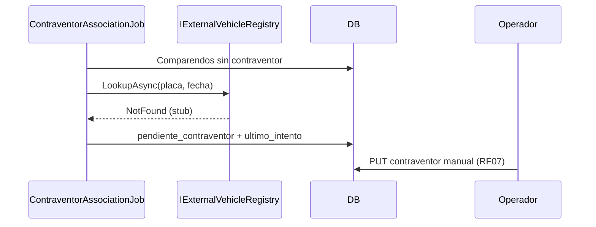
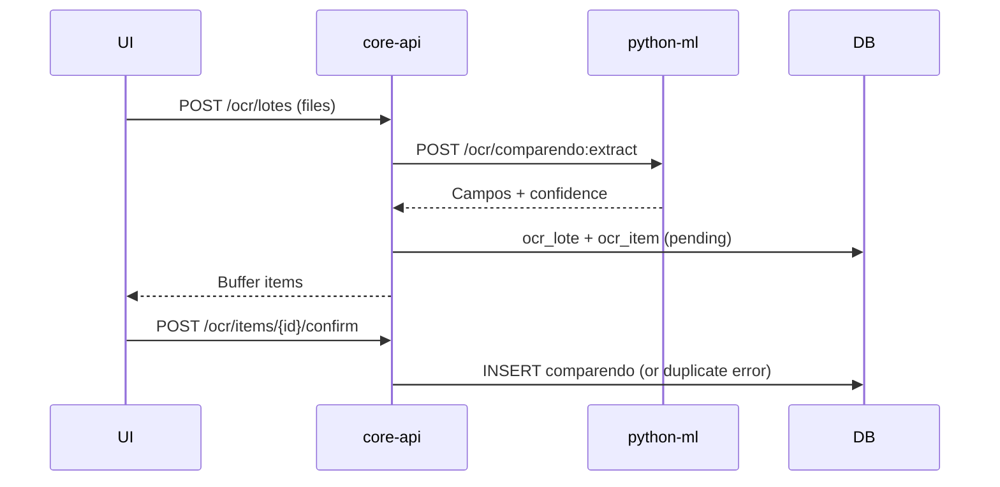

# Diseño técnico — Feature #9560 DGC Maestra Comparendos

> **Estado:** Aprobado (2026-06-10)  
> **ADR:** [ADR-0001](../decisions/ADR-0001-dgc-bounded-context-vialix.md) (Propuesto)  
> **Origen OpenSpec:** `openspec/changes/vialix-dgc-maestra/`  
> **ADO:** Feature [#9560](https://dev.azure.com/FlitDevOps) · HUs #9735–#9742  
> **Prototipo:** `flitready-suite/src/components/modules/dgc.tsx`  
> **Modo entrega:** `implement-feature.md` — rama única, commits por HU, PR sin merge automático

---

## 1. Objetivo

Centralizar comparendos de tránsito como master data multi-tenant: OCR con buffer, maestra 15 columnas, descuentos, contraventor automático/manual y auditoría de correos (lectura).

## 2. Alcance y exclusiones

| Incluido (RF01–RF10) | Excluido |
|----------------------|----------|
| OCR PDF/PNG/JPG + buffer | SIMIT directo |
| Maestra 15 columnas + días restantes | Planillas de pago |
| Planificador contraventor 1–3 ventanas | Generación DP (#9564) |
| Log correos + evidencia HTML (lectura) | Motor envío (#9563) — contrato escritura: `contracts/dgc/email-log-write-contract.md` |
| UI Flit Ready | Reglas dinámicas (#9710) |

## 3. Modelo de datos (conceptual)

**Schema:** `dgc`

```
comparendo (1) ──< contraventor (0..1 activo)
comparendo (1) ──< email_log (0..N)    [escritura: NOTIF]
ocr_lote (1) ──< ocr_item (1..N) ──> comparendo (0..1 tras confirm)
descuento_matriz (global | por secretaria_id)
contraventor_job_config (ventanas CRON)
```

**Unicidad RF03:** `UNIQUE (tenant_id, numero_comparendo)`

**RLS:** `tenant_id = current_setting('app.tenant_id')::uuid` en todas las tablas.

### Proyección 15 columnas (API maestra)

| # | Campo API | Origen |
|---|-----------|--------|
| 1 | estado | `comparendo.estado` |
| 2 | numero_comparendo | `comparendo.numero_comparendo` |
| 3 | infractor | `comparendo.infractor_nombre` |
| 4 | documento | `comparendo.documento` |
| 5 | placa | `comparendo.placa` |
| 6 | infraccion | `comparendo.infraccion_codigo` |
| 7 | fecha_comparendo | `comparendo.fecha_comparendo` |
| 8 | fecha_notificacion | `comparendo.fecha_notificacion` |
| 9 | dias_restantes | calculado (matriz) |
| 10 | secretaria | `secretaria_id` / catálogo |
| 11 | total | `comparendo.total_valor` |
| 12 | pago | `comparendo.estado_pago` |
| 13 | contraventor | join `contraventor` |
| 14 | dp | referencia nullable (solo lectura) |
| 15 | fuente | `ocr` \| `manual` \| `import` |

## 4. APIs (prefijo `/api/v1/dgc`)

| Método | Ruta | HU | Descripción |
|--------|------|-----|-------------|
| POST | `/ocr/lotes` | #9736 | Upload archivos → buffer |
| GET | `/ocr/lotes/{id}/items` | #9736 | Listar ítems buffer |
| POST | `/ocr/items/{id}/confirm` | #9736 | Persistir comparendo |
| GET | `/comparendos` | #9737 | Maestra paginada |
| GET | `/comparendos/{id}` | #9737 | Detalle + días restantes |
| PUT | `/comparendos/{id}/contraventor` | #9738 | Contingencia manual |
| GET | `/comparendos/{id}/emails` | #9739 | Log tracking |
| GET | `/emails/{id}/evidence` | #9739 | HTML evidencia |

OpenAPI canónico: `contracts/openapi/core-api.v1.yaml`

## 5. Arquitectura backend

```
Gdc.Modules.Dgc/
├── Domain/          # Entidades, puertos, errores tipados
├── Application/     # Commands/Queries + FluentValidation
└── Infrastructure/  # EF configs, repos, migraciones, jobs
Gdc.Api/Endpoints/DgcEndpoints.cs
```

Patrones: Result, UUIDv7, IClock, ProblemDetails RFC 7807.

## 6. Frontend

```
frontend/src/features/dgc/
├── api/             # TanStack Query hooks
├── components/      # Tabla, UploadDialog, DetailSheet
└── pages/           # app/(shell)/dgc/page.tsx
```

Referencia visual: tokens `flit-ready.md`, componentes de `dgc.tsx`.

## 7. Integraciones

| Sistema | Dirección | Notas |
|---------|-----------|-------|
| NOTIF #9563 | Escritura → `email_log` | Contrato interno; DGC solo lectura |
| AUTH #9561 | Sesión JWT | Fuera de este Feature |
| API vehículos | Consulta placa+fecha | `IExternalVehicleRegistry` — **proveedor TBD** (stub en #9738) |
| OCR | Extracción campos | **Tesseract 5** en `python-ml` vía `IOcrExtractor` |

### 7.1 OCR — Tesseract 5 (gratis)

**Decisión:** motor OCR en **Python** (`services/python-ml`), no en core-api.

| Opción | Costo | Encaje FLIT | Recomendación |
|--------|-------|-------------|---------------|
| **Tesseract 5** (`pytesseract` + OpenCV) | Gratis | Arquitectura FLIT (`python-ml`) | **Elegida** |
| EasyOCR | Gratis | Ya en stack python-ml | Fallback si baja confianza |
| Tesseract.NET en core-api | Gratis | Fuera de ADR servicios | Solo MVP si no hay python-ml |
| Azure Document Intelligence | Tier limitado | Pago/lock-in | Descartada |

**Endpoint python-ml (nuevo):**

```
POST /ocr/comparendo:extract
Content-Type: multipart/form-data
Body: file (PDF | PNG | JPG)
Response: { numero_comparendo, placa, documento, infractor, fecha, valor, infraccion, confidence, raw_text }
```

**Dependencias sistema (Docker/dev):** `tesseract-ocr`, `tesseract-ocr-spa`, `poppler-utils` (PDF→imagen).

**HU #9736 incluye:** scaffold mínimo `python-ml` (si no existe) + cliente HTTP en `Gdc.Modules.Dgc`.

### 7.2 API placa+fecha — proveedor por definir

**Estado:** el proveedor externo (Verifik, RUNT u otro) **aún no está definido**. No bloquea #9738.

**Estrategia:**

1. Puerto `IExternalVehicleRegistry` en Domain:

```
Task<ContraventorLookupResult> LookupAsync(string placa, DateOnly fechaInfraccion, CancellationToken ct);
// Found | NotFound | ProviderUnavailable
```

2. **`StubVehicleRegistry`** en prod/dev → siempre `NotFound` (no datos falsos en operación).
3. **Fixture en tests** → simular `Found` para validar asociación automática sin API real.
4. Adapter real (`VerifikVehicleRegistry`, etc.) cuando se defina proveedor — solo swap DI.
5. **RF07 = flujo operativo hoy:** formulario manual nombre/cédula/correo vía `PUT /comparendos/{id}/contraventor`.
6. Config futura: `VehicleRegistry:Provider`, `BaseUrl`, `ApiKey`.

### 7.3 Scheduler contraventor — `IHostedService`

**Decisión:** job RF06 con **`IHostedService` + `PeriodicTimer`** en `core-api`. Hangfire queda para el futuro si el equipo necesita dashboard/reintentos avanzados.

| Opción | Decisión |
|--------|----------|
| `IHostedService` | **Elegida** — 1–3 ventanas diarias, sin deps extra |
| Hangfire | Descartada en esta fase |

**Componentes HU #9738:**

| Pieza | Responsabilidad |
|-------|-----------------|
| `dgc.contraventor_job_config` | 1–3 ventanas CRON por tenant |
| `ContraventorAssociationHostedService` | Evalúa ventanas, dispara job |
| `ContraventorAssociationJob` | Comparendos sin contraventor → `LookupAsync` → asocia o marca `pendiente_contraventor` |
| `StubVehicleRegistry` | `NotFound` hasta proveedor real |
| `PUT …/contraventor` | Asociación manual (camino principal sin API) |



## 8. Secuencia — carga OCR



## 9. Entrega Git (reglas vialix)

| Regla | Valor |
|-------|-------|
| Rama | `feature/AB-9560-dgc-maestra` |
| Commits | Uno por HU: `HU9735: …`, `HU9736: …`, … |
| PR | Único a `develop` al cerrar lote |
| Merge | Manual por Líder Técnico — agentes no integran |

## 10. Orden de implementación

```
#9735 → #9736 → #9737 → #9738 → #9739 → #9740 → #9741 → #9742 → PR
```

## 11. Archivos previstos (alto nivel)

| Path | Acción |
|------|--------|
| `services/core-api/src/Gdc.Modules.Dgc/**` | Crear |
| `services/core-api/src/Gdc.Api/Endpoints/DgcEndpoints.cs` | Crear |
| `services/core-api/src/Gdc.Infrastructure/Migrations/*_DgcInitial.cs` | Crear |
| `contracts/openapi/core-api.v1.yaml` | Modificar |
| `frontend/src/features/dgc/**` | Crear |
| `services/python-ml/app/adapters/ml/tesseract_comparendo.py` | Crear (HU #9736) |
| `Gdc.Modules.Dgc/.../ContraventorAssociationHostedService.cs` | Crear (HU #9738) |
| `docs/decisions/ADR-*-dgc-bounded-context.md` | Crear (architecture-agent) |

## 12. Preguntas abiertas

1. ~~Proveedor OCR~~ → **Tesseract 5 en python-ml** (EasyOCR fallback opcional)  
2. ~~Proveedor API placa+fecha~~ → **TBD** — `StubVehicleRegistry` (`NotFound`); manual RF07 operativo  
3. ~~Scheduler~~ → **`IHostedService` + `PeriodicTimer`** (Hangfire descartado en esta fase)  
4. ¿Un PR o split backend/frontend si > 800 líneas?

---

**Siguiente paso:** `Implementa el Feature #9560 — modo feature-batch` (rama `feature/AB-9560-dgc-maestra`, inicio HU #9735).
