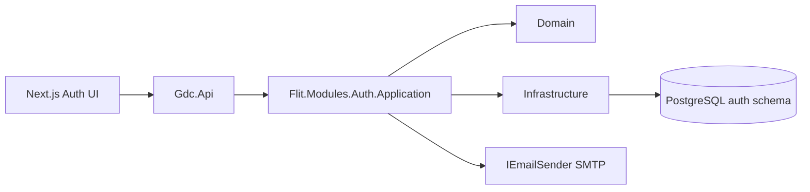
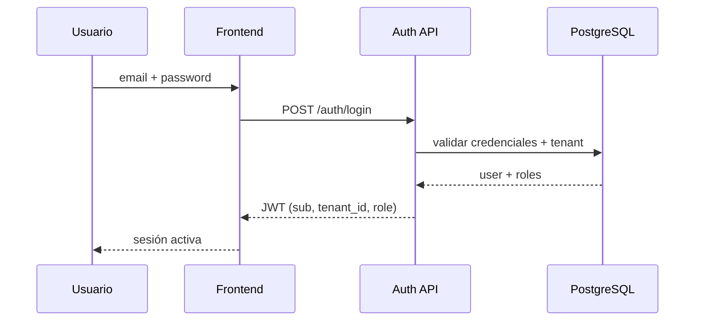

# Diseño técnico — Feature #9561 Auth Usuarios GDC

**ADO:** [#9561](https://dev.azure.com/FlitDevOps/FLIT%20-%20EVOLUTION/_workitems/edit/9561)  
**OpenSpec:** `openspec/changes/auth-usuarios-gdc/`  
**Estado:** Propuesto — pendiente aprobación Líder Técnico  
**Fecha:** 2026-06-10

## Resumen

Módulo transversal de autenticación multi-tenant con RBAC para GDC 2.0 / flit-vialix. Cubre RF01–RF09 del Feature padre.

## Alternativas evaluadas

| # | Opción | Esfuerzo | Recomendación |
|---|--------|----------|---------------|
| 1 | JWT propio + EF multi-tenant | M | **Recomendada** |
| 2 | Keycloak / IdP externo | L | Descartada (SSO fuera de alcance) |
| 3 | Solo session cookies | S | Descartada (API-first) |

## Arquitectura

## Sequence — Login

## Modelo de datos (conceptual)

Schema `auth`:
- `users`, `roles`, `permissions`, `role_permissions`, `user_roles`
- `activation_tokens`, `password_reset_tokens`, `revoked_tokens`

Todas las entidades de negocio incluyen `tenant_id`, `row_version`, auditoría.

## API (resumen)

| Método | Path | RF |
|--------|------|-----|
| POST | `/auth/login` | RF01 |
| POST | `/auth/logout` | RF02 |
| POST | `/auth/users/invite` | RF03 |
| POST | `/auth/users/activate` | RF04 |
| PUT | `/auth/users/{id}/password` | RF05 |
| POST | `/auth/password/forgot` | RF06 |
| POST | `/auth/password/reset` | RF06 |
| GET/PUT | `/auth/rbac/matrix` | RF07 |
| — | Global tenant filter | RF08 |
| — | Failed login policy | RF09 |

## Archivos a crear

**Backend:** `services/core-api/src/Flit.Modules.Auth/**`, endpoints en `Gdc.Api`, migración EF.  
**Frontend:** `frontend/src/features/auth/**`  
**Contratos:** `contracts/openapi/core-api.v1.yaml`  
**ADR:** `docs/decisions/ADR-0001-auth-jwt-multitenant.md`

## Descomposición en HUs (8)

Ver work items hijos del Feature #9561 en ADO.

## Notas QA / Security

- No enumerar emails en forgot-password (siempre 202).
- Tokens hash en BD, un solo uso, expiración 48h activación.
- Rate limiting en login.
- Habeas Data: email y nombre son PII — no loguear en plain text.
