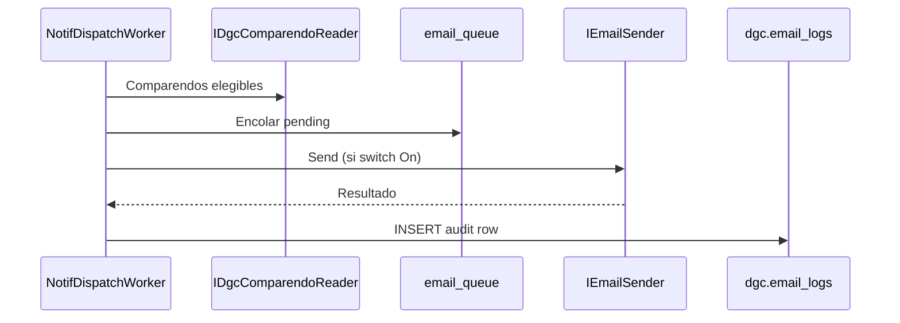

# Diseño técnico — Feature #9563 Motor de Notificaciones

> **Estado:** Aprobado (2026-06-10)  
> **ADR:** [ADR-0002](../decisions/ADR-0002-notif-bounded-context-vialix.md) (Propuesto)  
> **Origen OpenSpec:** `openspec/changes/vialix-notif-motor/`  
> **ADO:** Feature [#9563](https://dev.azure.com/FlitDevOps) · HUs #9743–#9750  
> **Prototipo:** `flitready-suite/src/components/modules/admin.tsx`  
> **Modo entrega:** `implement-feature.md` — rama única, commits por HU, PR sin merge automático

---

## 1. Objetivo

Motor multi-tenant de notificaciones por email: proveedor configurable, plantillas marca blanca, reglas automáticas sobre comparendos DGC y escritura de auditoría en `dgc.email_logs`.

## 2. Alcance y exclusiones

| Incluido (RF01–RF09) | Excluido |
|----------------------|----------|
| CRUD compañías (Super Admin) + perfil tenant | SSO / MFA (#9561) |
| Proveedor email (API, SendGrid, FLIT Mail) | Logs auditoría errores SMTP (RF10) |
| Plantillas HTML + banner/pie PNG/JPG | Fallback entre proveedores (RF11) |
| Reglas cronológicas y por estado comparendo | Adjuntos PDF en correo |
| Cola + switch On/Off | Plantillas PDF legales (#9564) |
| Escritura `dgc.email_logs` | Reglas dinámicas DP (#9710) |

## 3. Modelo de datos (conceptual)

**Schema:** `notif`

```
email_provider_config (1 activo por tenant)
email_template (1) ──< notification_rule (N)
notification_rule ──> email_queue (N) ──> comparendo DGC (FK lógica)
                              └──> INSERT dgc.email_logs (post-send)
```

**RLS:** `tenant_id = current_setting('app.tenant_id')::uuid` en todas las tablas.

## 4. APIs (prefijo `/api/v1/notif`)

| Método | Ruta | HU | Descripción |
|--------|------|-----|-------------|
| GET/POST/PUT/DELETE | `/companies` | #9744 | CRUD compañías (Super Admin) |
| GET/PUT | `/profile` | #9744 | Perfil tenant |
| GET/PUT | `/provider` | #9745 | Config proveedor |
| POST | `/provider/test` | #9745 | Test conexión |
| CRUD | `/templates` | #9746 | Plantillas email |
| POST | `/templates/{id}/preview` | #9746 | Preview con variables |
| CRUD | `/rules` | #9747 | Reglas comunicación |
| GET | `/queue` | #9747 | Cola envíos |
| PUT | `/switch` | #9747 | On/Off global |

OpenAPI canónico: `contracts/openapi/core-api.v1.yaml`

## 5. Arquitectura backend

```
Gdc.Modules.Notif/
├── Domain/          # Entidades, IEmailSender, IEmailLogWriter
├── Application/     # Commands/Queries + FluentValidation
└── Infrastructure/  # EF, SendGrid, worker, cifrado
Gdc.Api/Endpoints/NotifEndpoints.cs
NotifDispatchWorker (IHostedService)
```

Patrones: Result, UUIDv7, Strategy `IEmailSender`, contrato `contracts/dgc/email-log-write-contract.md`.

## 6. Frontend

```
frontend/src/features/notif/
├── api/
├── components/      # CompaniesTable, ProviderForm, TemplateEditor, RulesPanel
└── pages/           # app/(shell)/admin/notificaciones/
```

Referencia visual: `admin.tsx` en flitready-suite.

## 7. Integraciones

| Sistema | Dirección | Notas |
|---------|-----------|-------|
| DGC #9560 | Lectura comparendos + escritura `email_logs` | Contrato interno |
| AUTH #9561 | Sesión JWT / roles | Super Admin vs Tenant Admin |
| GDC #9564 | Sin dependencia directa | — |
| REGLAS #9710 | Sin solapamiento | Reglas DP ≠ reglas correo |

## 8. Secuencia — despacho regla



## 9. Entrega Git

| Regla | Valor |
|-------|-------|
| Rama | `feature/AB-9563-notificaciones` |
| Base | `develop` (post-merge #9560) |
| Commits | `HU9743:` … `HU9750:` |
| PR | Único a `develop` |
| Merge | Manual LT |

## 10. Orden de implementación

```
#9743 → (#9744 + #9745) → #9746 → #9747 → #9748 → #9749 → #9750 → PR
```

## 11. Archivos previstos

| Path | Acción |
|------|--------|
| `services/core-api/src/Gdc.Modules.Notif/**` | Crear |
| `services/core-api/src/Gdc.Api/Endpoints/NotifEndpoints.cs` | Crear |
| `services/core-api/src/Gdc.Infrastructure/Migrations/*_NotifInitial.cs` | Crear |
| `contracts/openapi/core-api.v1.yaml` | Modificar |
| `frontend/src/features/notif/**` | Crear |
| `docs/decisions/ADR-0002-notif-bounded-context-vialix.md` | Crear |

---

**Siguiente paso:** Activar HU #9743 → implementar schema `notif`.
